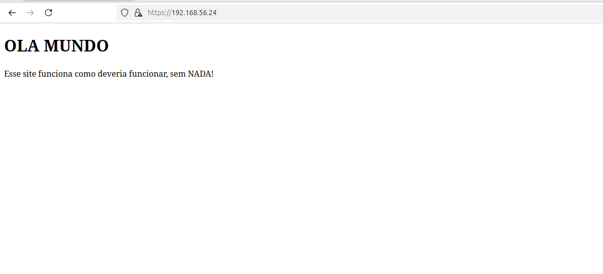
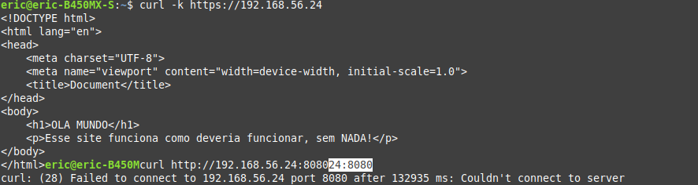
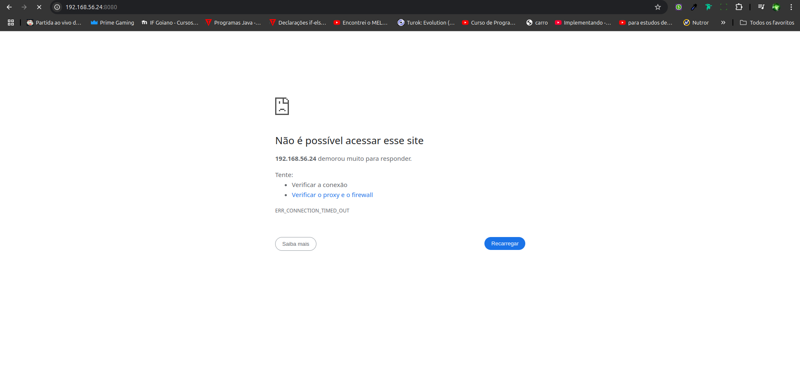

**Trabalho final de Segurança da informação**

***Hadware utilizado***

  Para o plano atual de hospedagem de aplicações web, é necessário uma máquina que seja competente para o volume de requisições que será recebido dos possíveis projetos que foram pensados. Nesse cenário, espera-se que o servidor receba 10 sites ou aplicações pequenos/médios, podendo haver exceções para alguns sites ou aplicações grandes(no máximo 4 requisições por segundo) cerca de 3.456.000 requisições por dia. Com esses requisitos levantados, será necessário uma máquina avaliado em R$33.999,00, sendo um servidor da dell o Servidor Torre PowerEdge T560, equipado com um processador de 12 núcleos e 20 threads, o poderosíssimo Intel® Xeon® Silver 4410Y. Com ele, será equipado dois pentes de 16 gigas de ram, totalizando 32 gigas de memória ram, com 4800MT/s de transferência,no entanto, será a feito um pedido especial para que possa ser utilizado 120gb de ram que ficá em torno de 7000 a mais no orçamento. E com isso adicionando mais 1,5 Teras de SSD usando o espelhamento RAID 1, que é utilizado em uma partição para backup dos arquivos importantes do sistema. 
	Essa configuração escolhida possui o sistema operacional Windows Server 2022 Standard, no entanto, a equipe de infra, decidiu que, seŕa totalmente alterado o sistema operacional, e será implementado um ubuntu server para ser sistema que será gerenciado pela equipe e para completar o processo 2 placas de redes de 10GB de Downloads e 8GB de Upload para ter conexão rapida e instável.

 ***Por que essa configuração?***

Essa configuranção foi seleciona para sustentabilizar os sistemas. Com uso de 120 de ram, vem para tentar suprir a necessidade em suportar as requisições visto que todos os sites vão possuir acesso a banco de dados é para isso tudo funcionar de forma rapida e acertiva, também fazemos a aquisição do SSD, por uma velocidade de transferenca alta. A escolha do processador foi feita devida a quantidade de threads que ele possui, assim, o processador teria recursos suficientes para que seja feita o processamento das atividades feita pelos sites.

***Qual tipo de site pode ser alocado em nosso servidor?***

Qualquer site que possua a media de 4 requisições p/s, sendo, sites de compras e vendas onlines, sites/aplicações empresariais, site com conexão com banco de dados, blogs e outros sites em gerais.

***Recursos de segurança***

O servidor deve estar devidamente seguro, para que seja atingido essa necessidade, será feito algumas implementações para ter um impacto siguinificativo na segurança do servidor. Serviços que serão implementados:
	- SSL/TLS;
 	- Firewall;
	- Fail2ban;
  
 ***Razão de uso de cada Ferramentas***

 **SSL/TLS:** Essa ferramenta foi escolhido por ser uma ferramenta com capacidade de criptografar as requisições entre usuario e servidor, sendo, muito util para transação com uso de cartão de crédito é entregas de informações dos usuários e seus dados, assim, no tráfego dessas informações algum usuário malicioso tentar roubar os dados por análise de tráfego, será dificultado o acesso aos dados, pois, estarão criptografados.

 **FIREWALL:** Essa ferramenta tem por sua vez varias utilizadades, pois o firewall e capaz de barrar acessos e liberar acessos ao computador por varias formas. No cenário do servidor criado, ele funcionou com um bloqueador de acessos as demais portas do servidor, sendo assim, um usuário malicioso tentar acessar o computador por alguma das 65.535 portas que o computador possuí o firewall iria barrar dando time out no acesso desse usuário, com excessão de apenas uma porta que foi liberada, a porta 443 que configura como uma porta https do servidor apache, que o mesmo e o servidor de implementação e anexo dos sites.

 **Fail2Ban:** Permitir que consiga fazer o rastreamento dos pacotes e banir os que tiverem com tentativas falhas de acessar a maquina, desse modo consigo evitar que tenha ataque de força bruta e outras atividades maliciosas. Pois ele monitora os logs so sistema em tempo real e toma medidas contra IPs suspeitos.

***Como rodar o projeto?***
**O que há no projeto** 
Nesse projeto possui alguns arquivos necessários para que seja implementado da forma correta veja os arquivos:
	- hots.conf: feito para configurar nome do host que será exibido;
 	- apache2.conf: feito para configurar também os host que será exibido;
  	- default-ssl.conf: feito para configurar https, indicando qual porta será usada, qual nome do host é qual o caminho dos certificados assinados para criptografia;
   	- dockerfile: usado para subir uma configuração do docker com apache é seus arquvios para o site é configurar os demais arquivos;
    	- ports.conf: usando para configurar qual porta o apache vai usar para a implementação do https(criptografia (ssl));
     	- vagrantfile: arquvio usado para subir a maquina virtual que aplicará as configuração usadas;
      	- pasta sites: local que são arquivados os sites para serem expostos;
       	- pasta ssl: local onde encontra os dois arquvios que são o certificado digital(apache.crt) e a chave de privada(apache.key);
		- provision: Local onde estão as configurações de segurança e linhas de comando para rodar o servidor.
	
**Para roda o projeto**
Para rodar o projeto e necessário o uso de alguns comandos (terminal linux), veja a lista abaixo:
	- Criar seu proprio certificado(opcional): sudo openssl req -x509 -nodes -days 365 -newkey rsa:2048 -keyout apache.key -out apache.crt;
 	- vagrant up: roda o vagrantfile;
  	- vagrant ssh (opcional): acessa a vm depois que estiver finalizado;

***Testes para realizar o funcionamento***

**SSL/TLS**
Para realizar o teste do projeto do ssl e bem simples,usando a url do seu site ou ip da vm que vem por padrão (https://192.168.56.24) que você configurou, deverá ser impresso o contéudo do site. Assim o ssl está da forma correta e configurada.

**Firewall**
Para esse teste e necessário utilizar o termianl linux que pode ser aberto com comando control + alt + t, e nele você usará o comando curl -k https://192.168.56.24 é assim o site será impresso na sua tela do terminal, isso demonstra que o firewall está aceitando a porta 443 do apache. Mas e negação das demais portas? para isso rode o comando curl http://192.168.56.24:8080, você notará que o terminal retornará um erro, ou um time out que significa que foi barrado a seu acesso pelo firewall, você também pode usar a url no seu navegador, http://192.168.56.24:8080, e receberá uma mensagem de o servidor demorou para responder ou algo assim.

***imagem demonstrando como será impresso o site:***

Você pode inclusive visualizar os certificados

**Imagem do teste no terminal FIREWALL:**

**Imagem do teste na URL FIREWALL NEGANDO O SERVIÇO:**

**Imagem do teste para o fail2ban fazer o bloqueio do IP:**

**Imagem do dos logs forneceidos pelo fail2ban:**

***Considerações finais***

Dessa maneira o projeto foi aplicando e testado com sucesso, lembrando que você pode configurar da maneira que desejar e melhorar o script

**Comandos a serem utilizados na apresentação**
 - vagrant up (rodar a VM)
 - vagrant status (mostrar que a VM está rodando)
 - sudo docker ps (verificar se subiu todos os conteiners)
 - sudo tail -f /var/log/auth.log (verificar os logs que tiveram no servidor)
 - sudo cat /var/log/auth.log (vizualização dos logs completos)
 - curl -k https://192.168.56.24 (retornar o site com o protocolo ssl instalado)
 - curl http://192.168.56.24:8080 (mostrar que a porta 80 está bloqueada)
 - ssh invaliduser@192.168.56.24 (tentar acessar a maquina para poder  o fail2ban travar)
 - sudo tail -f /var/log/auth.log (verificar os logs de autenticação)
 - sudo fail2ban-client status sshd (mostrar informações sobre o fail2ban, como os usuarios que foram banidos, por ter estourado o limite de tentaivas)

